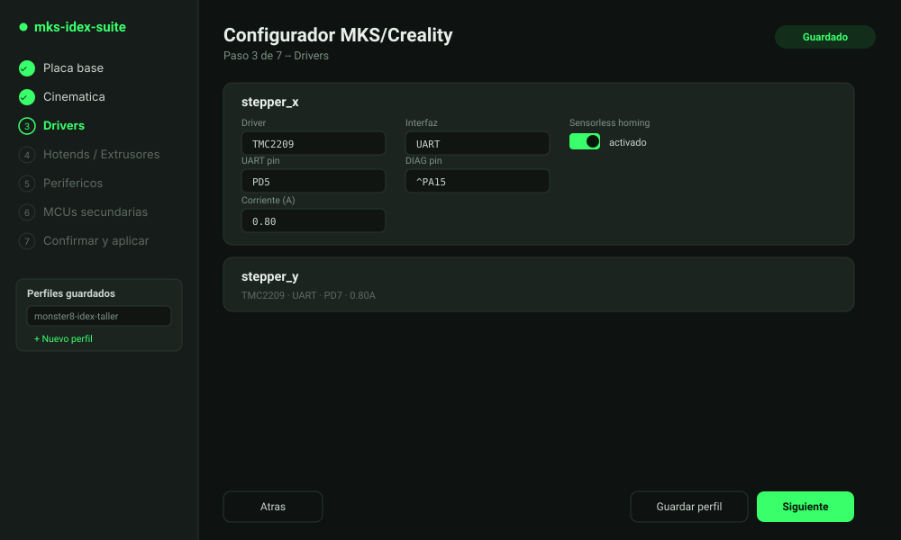
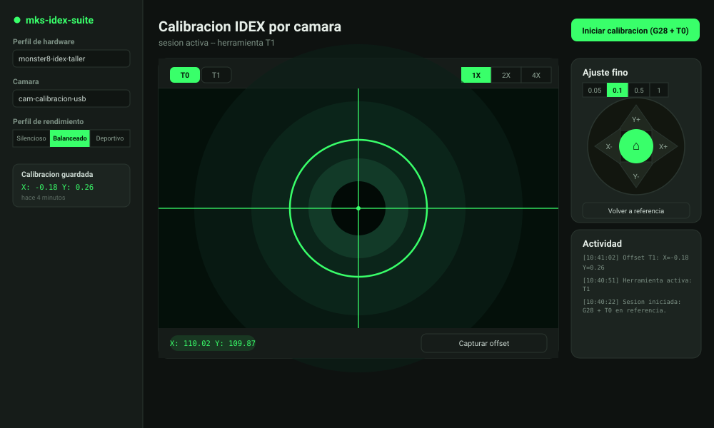
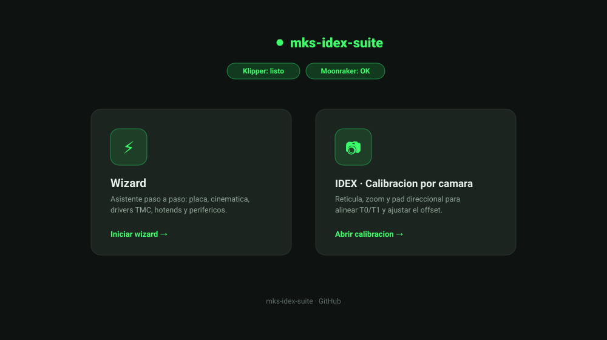
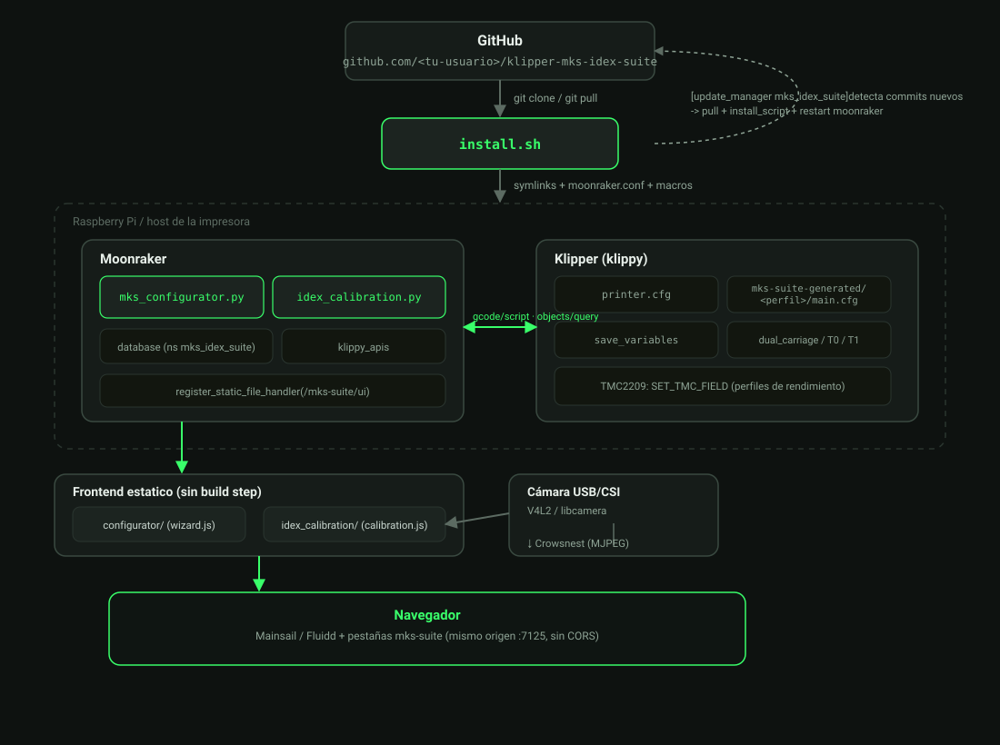

<p align="center">
  
</p>

<p align="center">
  Suite modular para Klipper/Moonraker: asistente de configuraci&#243;n de hardware (MKS/Creality),
  calibraci&#243;n visual de offsets IDEX por c&#225;mara, y despliegue autoinstalable v&#237;a GitHub.
</p>

---

## Modulos

| | |
|---|---|
| **1. Configurador** | Asistente paso a paso (estilo RatOS) que genera `printer.cfg` para 10 placas MKS/Creality -- cinematica cartesiana/CoreXY/IDEX, drivers TMC2209/2208/2225/2130 (UART/SPI por hardware o software, sensorless homing, toggle StealthChop/SpreadCycle) y A4988/DRV8825 (standalone), BLTouch, sensor de filamento, LEDs WS2812B y MCUs secundarias experimentales. Con placas donde el archivo oficial de Klipper trae pines TMC confirmados, el wizard los sugiere con un click. |
| **2. Calibracion IDEX** | Vista de camara con ret&#237;cula superpuesta, conmutador T0/T1, zoom digital 1x/2x/4x y pad direccional de micro-pasos (0.05 / 0.1 / 0.5 / 1 mm) para alinear visualmente ambas boquillas y persistir el offset sin `SAVE_CONFIG`. Incluye 3 perfiles de rendimiento (Silencioso/Balanceado/Deportivo) que se autoadaptan a los steppers realmente configurados. |
| **3. Instalador** | `git clone && ./install.sh`: symlinkea los componentes Python en Moonraker, agrega la config necesaria (con backup automatico) e integra `[update_manager]` para actualizar con un click desde Mainsail/Fluidd. |

<p align="center">
  
  
</p>

## Instalacion rapida

```bash
cd ~
git clone https://github.com/Chester547/klipper-mks-idex-suite.git
cd klipper-mks-idex-suite
./install.sh
```

Detalle completo, variables de entorno para instalaciones no estandar, y el **checklist de seguridad que deberias leer antes de aplicar un perfil de hardware**, en [`docs/INSTALL.md`](docs/INSTALL.md).

`install.sh` agrega un vhost de nginx dedicado (puerto `7140` por defecto) que sirve el frontend y hace proxy transparente de la API de Moonraker. Con eso arriba, una sola pagina de inicio estilo RatOS te lleva a los dos modulos:

```
http://<ip-de-tu-pi>:7140/
```

<p align="center">
  
</p>

Dos botones grandes: **⚡ Wizard** (Modulo 1) y **📷 IDEX · Calibracion asistida por camara** (Modulo 2) -- igual que hacer click en el boton "Wizard" de RatOS.

## Arquitectura

<p align="center">
  
</p>

- **Backend**: dos [componentes de Moonraker](https://moonraker.readthedocs.io/en/latest/components/) (`mks_configurator.py`, `idex_calibration.py`) que exponen endpoints REST propios, sin tocar el core de Moonraker.
- **Frontend**: HTML/CSS/JS vanilla sin build step, servido por un **vhost de nginx dedicado** (`install.sh` lo agrega, puerto `7140` por defecto) que hace proxy transparente de `/server/`, `/printer/`, `/api/`, `/access/`, `/machine/` y `/websocket` hacia Moonraker en `:7125` -- mismo origen para el navegador, sin CORS ni API key. *(Nota: Moonraker tiene su propio `register_static_file_handler`, pero fuerza `Content-Disposition: attachment` en todo archivo -- sirve para descargar logs/gcode, no para hostear HTML; por eso el frontend pasa por nginx.)*
- **Klipper**: los `.cfg` se generan con Jinja2 a partir de plantillas versionadas en `config_templates/`, y se incluyen en tu `printer.cfg` real via `[include ...]`. Los macros de calibraci&#243;n/rendimiento usan `save_variables` para persistir valores sin reiniciar Klipper.

## Estructura del repositorio

```
klipper-mks-idex-suite/
├── README.md
├── LICENSE
├── install.sh                      # instalador (symlinks, moonraker.conf, macros)
├── uninstall.sh
├── requirements.txt                 # jsonschema, Jinja2 (para moonraker-env)
│
├── moonraker/components/
│   ├── mks_suite_common.py          # paths, ProfileStore, render Jinja2, git, backups
│   ├── mks_configurator.py          # [mks_configurator] -- Modulo 1
│   └── idex_calibration.py          # [idex_calibration] -- Modulo 2
│
├── config_templates/                # fuente de verdad de TODOS los .cfg generados
│   ├── catalog/options.json         # listas desplegables + pines sugeridos (editables)
│   ├── boards/*.cfg.j2              # 10 placas, pines verificados contra klipper/config/
│   ├── drivers/tmc_common.cfg.j2    # macros Jinja2 TMC2208/2209/2225/2130 + endstop sensorless
│   ├── kinematics/{cartesian,corexy,idex}.cfg.j2
│   ├── peripherals/{bltouch,filament_sensor,led_effect}.cfg.j2
│   ├── mcu_secondary/{arduino_mega2560,stm32_generic,esp32}.cfg.j2
│   └── macros/
│       ├── performance_profiles.cfg       # Silencioso/Balanceado/Deportivo (autoadaptable)
│       └── idex_calibration_macros.cfg    # T0/T1/MKS_CAM_GOTO_REF
│
├── schema/                          # JSON Schema (draft-07) -- contrato de datos
│   ├── hardware_profile.schema.json
│   ├── camera_profile.schema.json
│   └── calibration_data.schema.json
│
├── profiles/                        # ejemplos de referencia (no requeridos para usar la suite)
│   ├── hardware/example_monster8_idex.json
│   └── camera/example_pi_camera_usb.json
│
├── frontend/                        # vanilla JS/CSS/SVG-Canvas, sin build step
│   ├── index.html, landing.css, landing.js    # pagina de inicio estilo RatOS (2 botones)
│   ├── shared/{api.js,theme.css}
│   ├── configurator/{index.html,wizard.js,wizard.css}
│   └── idex_calibration/{index.html,calibration.js,overlay.js,jogpad.js,calibration.css}
│
├── docs/
│   ├── INSTALL.md
│   ├── MODULE1_CONFIGURATOR.md
│   ├── MODULE2_IDEX_CALIBRATION.md
│   ├── moonraker_update_manager.conf.example
│   └── images/{banner,architecture-diagram,landing-mockup,wizard-mockup,camera-calibration-mockup}.svg
│
└── tests/
    └── test_offset_calc.py          # python -m unittest discover -s tests
```

## Placas soportadas

MKS Robin Nano v1.2 &#183; MKS Robin Nano V2 &#183; MKS Robin Nano V3 &#183; MKS Robin E3 (V1.1) &#183; MKS Monster8 V2 &#183; MKS RUMBA32 V1.0 &#183; MKS SGEN_L V1.0 &#183; Creality v4.2.2 &#183; Creality v4.2.7 &#183; Creality Ender 3 MAX -- ver [confianza de pinout por placa](docs/INSTALL.md#confianza-de-pinout-por-placa) antes de la primera puesta en marcha.

Drivers: TMC2209, TMC2208, TMC2225, TMC2130 (SPI hardware o software), A4988, DRV8825.

## Integracion con Moonraker Update Manager

`install.sh` agrega esto automaticamente (con tu ruta y remoto reales); referencia completa en [`docs/moonraker_update_manager.conf.example`](docs/moonraker_update_manager.conf.example):

```ini
[update_manager mks_idex_suite]
type: git_repo
path: ~/klipper-mks-idex-suite
origin: https://github.com/<tu-usuario>/klipper-mks-idex-suite.git
primary_branch: main
managed_services: moonraker
is_system_service: False
install_script: install.sh
requirements: requirements.txt
```

## Seguridad

Este proyecto genera configuracion para hardware que calienta a m&#225;s de 200&#176;C. Los pines de motores/heaters/fan de cada placa fueron contrastados contra los archivos oficiales de `klipper/config/` (ver tabla en [INSTALL.md](docs/INSTALL.md)), pero **nunca** apliques un perfil y calientes sin supervision directa la primera vez, y confirma `heater_pin`/`sensor_pin` contra tu placa fisica antes de hacerlo.

## Licencia

[MIT](LICENSE) -- las plantillas de placa se basan en la estructura de pines documentada por el proyecto [Klipper](https://github.com/Klipper3d/klipper) (GPL-3.0); revisa `klipper/config/` si vas a redistribuir configuraciones derivadas.
